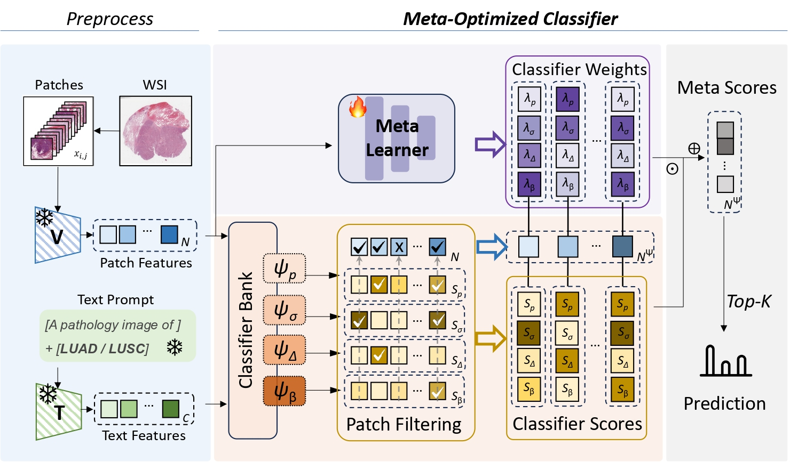

# MOC: Meta-Optimized Classifier

[](https://www.arxiv.org/abs/2508.09967)

This repository contains the official PyTorch implementation for our paper:

**MOC: Meta-Optimized Classifier for Few-Shot Whole Slide Image Classification** (MICCAI 2025)



## Preparation

### 1. Data Preparation

-   **WSI Preprocessing**: This repository does not include scripts for Whole Slide Image (WSI) preprocessing. Please follow the official [CLAM](https://github.com/mahmoodlab/CLAM) pipeline to extract WSI features.
    -   **Note**: Subtypes of the same cancer should be merged into a single folder. For example, place preprocessed `luad` and `lusc` features into the same folder named `nsclc/merge_features_conch`.
    -   We primarily use `h5_files` as they preserve the coordinate information of the patches.
    -   The default data storage path can be modified in `main_moc.py` at lines `205` and `266`.

-   **Example Data Directory Structure**:
    ```bash
    data/
    ├── nsclc/
    │   └── merge_features_conch/
    │        ├── h5_files/
    │        └── pt_files/
    └── rcc/
        └── ...
    ```

-   **Dataset Information**: Dataset definitions and split information have been placed in the `dataset_csv/` and `splits/` directories, respectively.

### 2. Model Preparation

-   Download the CONCH model checkpoint from [Hugging Face](https://huggingface.co/MahmoodLab/CONCH).
-   The default path for the checkpoint is `models/conch_checkpoint.bin`. This path can be changed in `main_moc.py` at line `135`.

## Training & Evaluation

### Train

Modify the CUDA device ID and dataset name in the `scripts/moc_train.sh` script, then run:

```bash
bash scripts/moc_train.sh
```

### Evaluation

Modify the relevant configurations in the `scripts/moc_eval.sh` script, then run:

```bash
bash scripts/moc_eval.sh
```

## Citation

If you use this code or our method in your research, please cite our paper:

```bibtex
@article{xiang2025moc,
  title={MOC: Meta-Optimized Classifier for Few-Shot Whole Slide Image Classification},
  author={Xiang, Tianqi and Li, Yi and Zhang, Qixiang and Li, Xiaomeng},
  journal={arXiv preprint arXiv:2508.09967},
  year={2025}
}
```